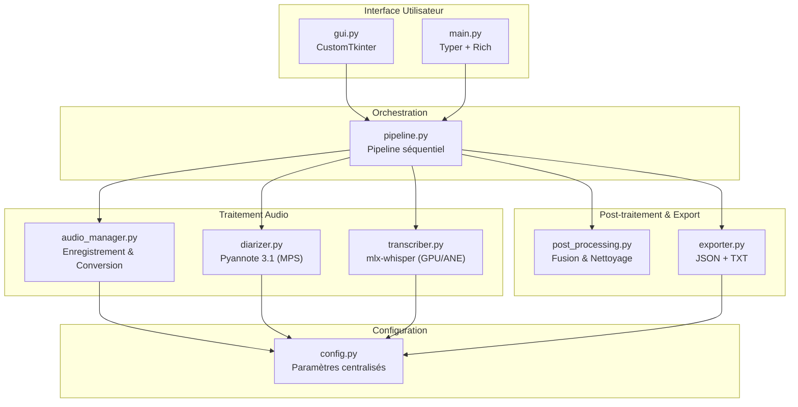
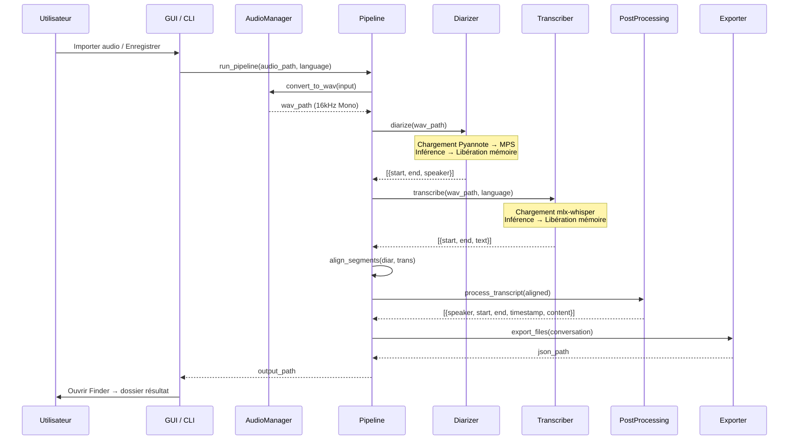
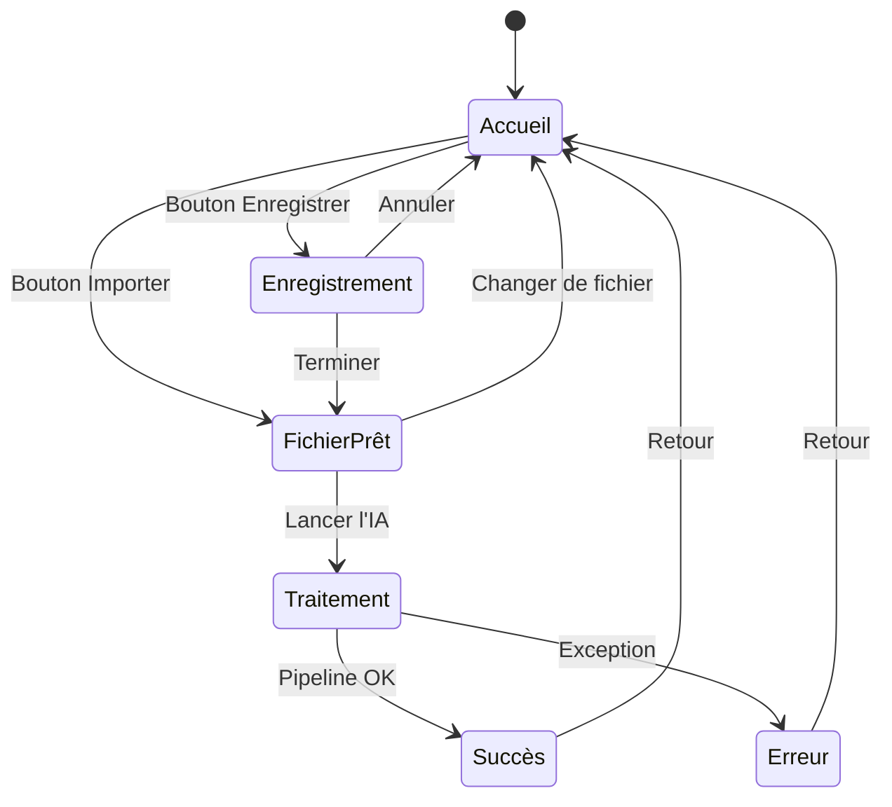
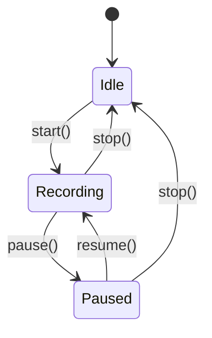
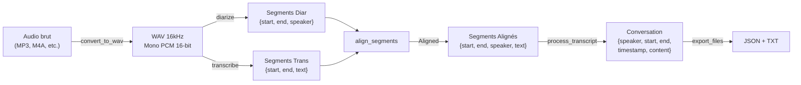
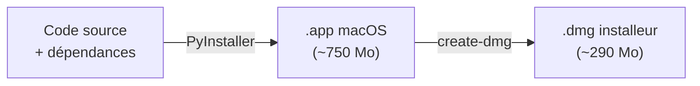

# Note Taker Offline — Documentation Technique

> **Version** : 2.0.0  
> **Projet** : Note Taker Offline (anciennement « CR Reunion »)  
> **Branding** : *Awesome Offline Note Taker by GiG Consulting*  
> **Date** : Mars 2026  

---

## Table des matières

1. [Executive Summary](#1-executive-summary)
2. [Architecture Overview](#2-architecture-overview)
3. [Design Decisions](#3-design-decisions)
4. [Core Components](#4-core-components)
5. [Data Models](#5-data-models)
6. [Integration Points](#6-integration-points)
7. [Deployment Architecture](#7-deployment-architecture)
8. [Performance Characteristics](#8-performance-characteristics)
9. [Security Model](#9-security-model)
10. [Appendices](#10-appendices)

---

## 1. Executive Summary

**Note Taker Offline** est une application macOS native, 100% hors-ligne, conçue pour enregistrer, transcrire et diariser (identifier « qui parle ») des réunions de longue durée (jusqu'à 3 heures).

L'application est optimisée pour les puces **Apple Silicon** (M1/M2/M3/M4) et exploite conjointement :
- **MLX** (framework Apple) pour la transcription speech-to-text via Whisper Large-v3 quantifié 4-bit,
- **Pyannote 3.1** avec accélération **MPS** (Metal Performance Shaders) pour l'identification des locuteurs.

Elle est distribuée sous forme d'installeur `.dmg` (~290 Mo), compilée via **PyInstaller**, et ne nécessite aucune installation de Python par l'utilisateur final. Après le premier lancement (téléchargement des modèles IA ~3 Go), l'application fonctionne **sans aucune connexion réseau**.

### Chiffres clés

| Métrique | Valeur |
|:---|:---|
| Lignes de code Python | ~1 200 |
| Modules source | 9 |
| Taille `.app` | ~750 Mo |
| Taille `.dmg` | ~290 Mo |
| RAM au pic | < 6 Go |
| Ratio transcription | ≤ 0.05x (temps réel) |
| Ratio diarisation | < 0.15x (temps réel) |
| Durée max supportée | 3 heures |

---

## 2. Architecture Overview

### 2.1 Vue d'ensemble du système



### 2.2 Arborescence du projet

```text
CR reunion/
├── src/
│   ├── __init__.py           # Déclaration du package Python
│   ├── main.py               # Point d'entrée dual (GUI si aucun arg, CLI sinon)
│   ├── config.py             # Configuration centralisée + détection PyInstaller
│   ├── gui.py                # Interface graphique CustomTkinter (5 vues)
│   ├── pipeline.py           # Orchestrateur séquentiel du traitement
│   ├── audio_manager.py      # Enregistrement micro + conversion audio
│   ├── diarizer.py           # Identification des locuteurs (Pyannote)
│   ├── transcriber.py        # Transcription audio (mlx-whisper)
│   ├── post_processing.py    # Fusion, filtrage, nettoyage du transcript
│   └── exporter.py           # Export JSON + TXT
├── assets/
│   ├── logos/                 # Logos GiG Consulting (PNG)
│   ├── AppIcon.icns           # Icône macOS native (toutes résolutions)
│   └── AppIcon.iconset/       # Iconset source
├── tests/
│   └── generate_test_audio.py # Générateur d'audio synthétique de test
├── app.spec                   # Configuration PyInstaller
├── build_dmg.sh               # Script de création du .dmg
├── setup.sh                   # Installation automatisée de l'environnement dev
├── run.sh                     # Lancement rapide en mode développement
├── requirements.txt           # Dépendances Python
├── .env                       # Token Hugging Face (HF_TOKEN)
├── README.md                  # Documentation d'installation rapide
├── PRD reunion.md             # Product Requirements Document
├── Specifications systeme.md  # Spécifications matérielles cibles
└── CHANGELOG.md               # Historique des versions
```

### 2.3 Flux de données principal



---

## 3. Design Decisions

### 3.1 Pipeline strictement séquentiel

> **Décision** : Exécuter diarisation et transcription séquentiellement, jamais en parallèle.

**Pourquoi** : La RAM unifiée d'Apple Silicon est partagée entre CPU et GPU. Pyannote (via PyTorch/MPS) et mlx-whisper (via MLX) consomment chacun ~1.5-3 Go de RAM GPU. Les exécuter en parallèle saturerait les 16 Go de la machine cible.

**Conséquence** : Chaque étape charge son modèle, effectue l'inférence, puis libère explicitement la mémoire (`gc.collect()`, `torch.mps.empty_cache()`) avant de passer à l'étape suivante. Le pic de RAM reste sous 6 Go.

Référence : [pipeline.py](file:///Users/gillesguiral/Developer/CR%20reunion/src/pipeline.py) — Étapes 2 et 3

### 3.2 Modèle Whisper large-v3 (quantifié 4-bit)

> **Décision** : Utiliser `large-v3` au lieu de `distil-large-v3`.

**Pourquoi** : Le modèle `distil-large-v3` est **strictement anglophone**. Il générait des « traductions fantômes » : le contenu français était transcrit en anglais. Le modèle `large-v3` complet supporte 99 langues et assure une transcription fidèle dans la langue originale.

**Atténuation de la taille** : La version quantifiée 4-bit via `mlx-community/whisper-large-v3-mlx` réduit l'empreinte mémoire à ~1.5 Go tout en préservant la précision multilingue.

**Sécurité supplémentaire** : Le paramètre `task="transcribe"` est forcé (et non `task="translate"`) pour empêcher toute traduction automatique.

Référence : [transcriber.py:51](file:///Users/gillesguiral/Developer/CR%20reunion/src/transcriber.py#L51)

### 3.3 Double interface (GUI + CLI)

> **Décision** : Un unique point d'entrée (`main.py`) qui lance la GUI sans arguments, ou la CLI avec arguments.

**Pourquoi** : 
- La GUI (CustomTkinter) cible les utilisateurs non-techniques qui veulent un bouton « Lancer l'IA ».
- La CLI (Typer + Rich) cible les développeurs et les scripts d'automatisation.

Le choix se fait par détection des arguments `sys.argv` :

```python
# main.py:145-151
if __name__ == "__main__":
    import sys
    if len(sys.argv) == 1:
        from src.gui import launch_gui
        launch_gui()
    else:
        app()
```

### 3.4 Détection automatique des locuteurs

> **Décision** : Pas de borne min/max par défaut pour le nombre de locuteurs.

**Pourquoi** : Pyannote 3.1 intègre un algorithme de clustering qui détermine automatiquement le nombre optimal de locuteurs. Forcer des bornes peut mener à des sur-segmentations ou sous-segmentations. Les bornes restent disponibles comme option CLI pour les cas spécifiques.

Référence : [config.py:51-52](file:///Users/gillesguiral/Developer/CR%20reunion/src/config.py#L51-L52)

### 3.5 Stockage temporaire dans /tmp

> **Décision** : Les fichiers audio de transit sont stockés dans `/tmp/cr_reunion/`, pas dans le dossier du projet.

**Pourquoi** : 
- Éviter de polluer le dossier du projet avec des fichiers WAV volumineux.
- Profiter du nettoyage automatique par l'OS.
- Le fichier WAV final est **déplacé** (pas copié) dans le dossier d'export de la réunion.

### 3.6 Alignement par chevauchement temporel maximal

> **Décision** : Pour chaque segment de transcription, le speaker assigné est celui dont le segment de diarisation a le plus grand chevauchement temporel.

**Pourquoi** : La diarisation et la transcription produisent des segmentations indépendantes avec des frontières temporelles qui ne coïncident pas exactement. L'algorithme de chevauchement maximal (overlap) est simple, robuste, et donne des résultats fiables dans la majorité des cas.

```python
# pipeline.py:43-66
for t_seg in transcription_segments:
    best_speaker = "UNKNOWN"
    best_overlap = 0.0
    for d_seg in diarization_segments:
        overlap_start = max(t_start, d_seg["start"])
        overlap_end = min(t_end, d_seg["end"])
        overlap = max(0.0, overlap_end - overlap_start)
        if overlap > best_overlap:
            best_overlap = overlap
            best_speaker = d_seg["speaker"]
```

---

## 4. Core Components

### 4.1 `config.py` — Configuration centralisée

**Fichier** : [config.py](file:///Users/gillesguiral/Developer/CR%20reunion/src/config.py)  
**Lignes** : 62  
**Rôle** : Point unique de vérité pour tous les paramètres de l'application.

#### Responsabilités

1. **Détection du mode d'exécution** : Détermine si l'application tourne en développement ou dans un bundle PyInstaller (`sys._MEIPASS`).
2. **Gestion des chemins** : `PROJECT_ROOT`, `DATA_DIR`, `RAW_DIR`, `CONVERTED_DIR`, `OUTPUT_DIR`.
3. **Configuration audio** : `SAMPLE_RATE`, `CHANNELS`, `AUDIO_FORMAT`, `SUBTYPE`, `CHUNK_DURATION_SEC`.
4. **Configuration des modèles IA** : `DIARIZATION_MODEL`, `WHISPER_MODEL`, `WHISPER_QUANT`.
5. **Chargement du `.env`** : Token Hugging Face (`HF_TOKEN`).

#### Mécanisme de détection PyInstaller

```python
if getattr(sys, '_MEIPASS', None):
    PROJECT_ROOT = Path(sys._MEIPASS)
    os.environ["PATH"] = sys._MEIPASS + os.pathsep + os.environ.get("PATH", "")
    # Charge .env depuis le bundle ou le home
else:
    PROJECT_ROOT = Path(__file__).resolve().parent.parent
    load_dotenv()
```

> [!IMPORTANT]
> Ce mécanisme est **critique** pour le fonctionnement de l'application empaquetée. `_MEIPASS` est le dossier temporaire où PyInstaller extrait les fichiers bundlés. Sans l'ajout de ce dossier au `PATH`, `pydub` ne trouve pas `ffmpeg`.

#### Constantes clés

| Constante | Valeur | Usage |
|:---|:---|:---|
| `SAMPLE_RATE` | 16 000 Hz | Standard Whisper & Pyannote |
| `CHANNELS` | 1 (Mono) | Requis par les modèles |
| `SUBTYPE` | PCM_16 | 16-bit pour qualité/taille optimale |
| `CHUNK_DURATION_SEC` | 5 s | Blocs d'écriture enregistrement |
| `WHISPER_MODEL` | `large-v3` | Modèle multilingue complet |
| `WHISPER_QUANT` | `4bit` | Quantification mémoire |
| `DIARIZATION_MODEL` | `pyannote/speaker-diarization-3.1` | Dernier modèle Pyannote |
| `OUTPUT_DIR` | `~/Documents/CR_Reunions/` | Exports utilisateur |

---

### 4.2 `main.py` — Point d'entrée dual

**Fichier** : [main.py](file:///Users/gillesguiral/Developer/CR%20reunion/src/main.py)  
**Lignes** : 152  
**Rôle** : Routeur vers la GUI ou la CLI selon les arguments.

#### Commandes CLI

| Commande | Options | Description |
|:---|:---|:---|
| `process` | `--input`, `--language`, `--output`, `--min-speakers`, `--max-speakers` | Traite un fichier audio existant |
| `record` | `--language`, `--filename` | Enregistre via le micro puis traite |

#### Couche d'interaction CLI

La CLI utilise **Typer** pour le parsing des arguments et **Rich** pour l'affichage formaté (panels, couleurs). Le mode enregistrement CLI intègre un mini-REPL interactif :
- `Entrée` → Démarrer / Reprendre
- `p` → Pause
- `q` → Arrêter et proposer le traitement

---

### 4.3 `gui.py` — Interface graphique

**Fichier** : [gui.py](file:///Users/gillesguiral/Developer/CR%20reunion/src/gui.py)  
**Lignes** : 351  
**Framework** : CustomTkinter (thème sombre)

#### Architecture par vues

L'interface suit un parcours linéaire en **5 vues**, implémentées comme des méthodes `show_*_view()` de la classe `CRReunionApp(ctk.CTk)` :



| Vue | Méthode | Description |
|:---|:---|:---|
| **Accueil** | `show_home_view()` | Logo GiG, boutons Enregistrer / Importer |
| **Enregistrement** | `show_record_view()` | Micro en direct, chronomètre, boutons Start/Pause/Stop |
| **Fichier Prêt** | `show_ready_view()` | Confirmation du fichier, sélection de la langue |
| **Traitement** | `show_processing_view()` | Barre de progression indéterminée |
| **Succès / Erreur** | `show_success_view()` / `show_error_view()` | Résultat avec ouverture auto du Finder |

#### Pattern de transition

Chaque vue commence par `self.clear_container()` qui détruit tous les widgets du conteneur actuel, puis reconstruit l'interface. Ce pattern "single container" évite les fuites mémoire de widgets Tkinter.

#### Traitement en thread séparé

Le pipeline IA est exécuté dans un `threading.Thread` pour ne pas bloquer la boucle d'événements de l'interface :

```python
thread = threading.Thread(target=self.process_file_thread, args=(self.selected_file_path, lang))
thread.start()
```

Les callbacks vers l'UI utilisent `self.after(0, callback)` pour revenir dans le thread principal (thread-safe pour Tkinter).

---

### 4.4 `audio_manager.py` — Gestion audio

**Fichier** : [audio_manager.py](file:///Users/gillesguiral/Developer/CR%20reunion/src/audio_manager.py)  
**Lignes** : 158  
**Rôle** : Enregistrement micro en temps réel + conversion de formats audio.

#### Classe `AudioRecorder`

Machine à états simple pour l'enregistrement :



**Écriture par blocs** : Le callback `_audio_callback` écrit les données audio par chunks de 5 secondes directement dans le fichier WAV. Cela garantit que l'audio est sauvé même en cas d'arrêt brutal de l'application.

```python
def _audio_callback(self, indata, frames, time_info, status):
    if self.is_recording and not self.is_paused:
        if self._file is not None:
            self._file.write(indata.copy())
```

> [!WARNING]
> `indata.copy()` est obligatoire car `sounddevice` réutilise le buffer — un simple `indata` pointerait vers des données écrasées au prochain callback.

#### Fonction `convert_to_wav()`

Convertit tout format audio supporté (MP3, M4A, OGG, FLAC, WAV, WMA, AAC) vers le format interne **WAV 16kHz Mono PCM 16-bit** :

1. Vérifie que le format est supporté.
2. Si c'est déjà un WAV au bon format → copie simple.
3. Sinon → conversion via `pydub` (qui utilise `ffmpeg` en subprocess).
4. Libère la mémoire (`gc.collect()`).

---

### 4.5 `diarizer.py` — Identification des locuteurs

**Fichier** : [diarizer.py](file:///Users/gillesguiral/Developer/CR%20reunion/src/diarizer.py)  
**Lignes** : 102  
**Modèle** : `pyannote/speaker-diarization-3.1`

#### Processus

1. Vérifie la présence du `HF_TOKEN`.
2. Charge le pipeline Pyannote depuis Hugging Face (ou le cache local).
3. Transfère le modèle vers le device **MPS** (Metal) si disponible, sinon CPU.
4. Exécute la diarisation avec un `ProgressHook` pour le suivi.
5. Extrait les segments `{start, end, speaker}`.
6. **Libère la mémoire** : `del pipeline`, `torch.mps.empty_cache()`, `gc.collect()`.

#### Compatibilité Pyannote v3 / v4

Le code gère les deux versions de l'API Pyannote :

```python
# pyannote v4 : DiarizeOutput.speaker_diarization → Annotation
# pyannote v3 : le résultat est directement une Annotation
if hasattr(diarization, 'speaker_diarization'):
    annotation = diarization.speaker_diarization
else:
    annotation = diarization
```

---

### 4.6 `transcriber.py` — Transcription ASR

**Fichier** : [transcriber.py](file:///Users/gillesguiral/Developer/CR%20reunion/src/transcriber.py)  
**Lignes** : 89  
**Moteur** : `mlx-whisper` (framework MLX d'Apple)

#### Mapping des modèles

Le module maintient un dictionnaire de correspondance entre les noms courts et les repos Hugging Face MLX :

| Nom court | Repo Hugging Face |
|:---|:---|
| `large-v3` | `mlx-community/whisper-large-v3-mlx` |
| `distil-large-v3` | `mlx-community/distil-whisper-large-v3` |
| `large-v2` | `mlx-community/whisper-large-v2-mlx` |
| `medium` | `mlx-community/whisper-medium-mlx` |
| `small` | `mlx-community/whisper-small-mlx` |
| `base` | `mlx-community/whisper-base-mlx` |
| `tiny` | `mlx-community/whisper-tiny-mlx` |

#### Modes de langue

| Mode | Comportement |
|:---|:---|
| `language=None` | Auto-détection (premiers 30s d'audio) |
| `language="fr"` | Forçage français |
| `language="en"` | Forçage anglais |

Dans tous les cas, `task="transcribe"` est forcé pour éviter les traductions automatiques.

#### Sortie

Liste de segments `{start: float, end: float, text: str}`. Un fallback produit un segment unique si la réponse de Whisper ne contient pas de segments.

---

### 4.7 `pipeline.py` — Orchestrateur

**Fichier** : [pipeline.py](file:///Users/gillesguiral/Developer/CR%20reunion/src/pipeline.py)  
**Lignes** : 179  
**Rôle** : Enchaîne les 5 (+0.5) étapes du traitement.

#### Séquence d'exécution

| Étape | Module | Action |
|:---|:---|:---|
| 1/5 | `audio_manager` | Conversion audio → WAV 16kHz Mono |
| 2/5 | `diarizer` | Diarisation → segments speakers |
| 3/5 | `transcriber` | Transcription → segments texte |
| 4/5 | `pipeline` | Alignement temporel (overlap maximal) |
| 4.5/5 | `post_processing` | Fusion, filtrage, nettoyage |
| 5/5 | `exporter` | Export JSON + TXT |

#### Gestion des dossiers de sortie

Chaque réunion produit un dossier horodaté dans `~/Documents/CR_Reunions/` :

```
~/Documents/CR_Reunions/
└── 2026-03-28_14h30_recording/
    ├── transcript.json    # Format structuré (LLM-ready)
    ├── transcript.txt     # Format humain lisible
    └── recording_converted.wav  # Audio source conservé
```

---

### 4.8 `post_processing.py` — Nettoyage intelligent

**Fichier** : [post_processing.py](file:///Users/gillesguiral/Developer/CR%20reunion/src/post_processing.py)  
**Lignes** : 91  
**Rôle** : Transformer les chunks bruts en blocs de conversation fluides.

#### Algorithme de fusion

La fonction `process_transcript()` parcourt les segments alignés et fusionne ceux qui remplissent **deux conditions** :
1. **Même locuteur** (`is_same_speaker`)
2. **Pause ≤ 2 secondes** (`max_pause`)

Cela transforme par exemple 47 chunks bruts en 12 blocs de conversation continus.

#### Filtrage

| Filtre | Règle |
|:---|:---|
| Segments vides | Ignorés si `text` est vide |
| Ponctuation isolée | Ignorée si segment < 2 caractères et uniquement ponctuation |
| Mots d'hésitation non attribués | Ignorés si `speaker == "UNKNOWN"` et < 2 mots |

#### Nettoyage du texte

`clean_text()` normalise :
- Espaces multiples → espace simple
- Majuscule initiale
- Trim

---

### 4.9 `exporter.py` — Export dual

**Fichier** : [exporter.py](file:///Users/gillesguiral/Developer/CR%20reunion/src/exporter.py)  
**Lignes** : 85  
**Rôle** : Génération des fichiers de sortie JSON et TXT.

#### Format JSON (`transcript.json`)

Conçu pour être injecté dans un LLM :

```json
{
  "metadata": {
    "source_file": "reunion.mp3",
    "language": "fr",
    "processed_at": "2026-03-28T14:30:00.000000",
    "duration_seconds": 1842.50,
    "num_blocks": 12,
    "speakers": ["SPEAKER_00", "SPEAKER_01", "SPEAKER_02"],
    "num_speakers": 3
  },
  "conversation": [
    {
      "speaker": "SPEAKER_00",
      "start": 0.52,
      "end": 15.80,
      "timestamp": "00:00:00 - 00:00:15",
      "content": "Bonjour à tous, merci d'être présents..."
    }
  ]
}
```

#### Format TXT (`transcript.txt`)

Lisible par un humain :

```
Réunion : reunion.mp3
Date de traitement : 2026-03-28 14:30
==================================================

[00:00:00 - 00:00:15] SPEAKER_00 :
Bonjour à tous, merci d'être présents...

[00:00:16 - 00:00:45] SPEAKER_01 :
Merci Jean, commençons par le premier point...
```

---

## 5. Data Models

### 5.1 Flux de transformation des données



### 5.2 Schémas de données

#### Segment de Diarisation

```python
{
    "start": 0.523,    # float — temps en secondes (3 décimales)
    "end": 4.812,      # float — temps en secondes
    "speaker": "SPEAKER_00"  # str — ID anonyme Pyannote
}
```

#### Segment de Transcription

```python
{
    "start": 0.0,      # float — temps en secondes (3 décimales)
    "end": 5.120,      # float — temps en secondes
    "text": "Bonjour à tous"  # str — texte transcrit
}
```

#### Segment Aligné

```python
{
    "start": 0.523,
    "end": 4.812,
    "speaker": "SPEAKER_00",
    "text": "Bonjour à tous"
}
```

#### Bloc de Conversation (post-traité)

```python
{
    "speaker": "SPEAKER_00",
    "start": 0.52,     # float — arrondi à 2 décimales
    "end": 15.80,
    "timestamp": "00:00:00 - 00:00:15",  # str — format humain
    "content": "Bonjour à tous, merci d'être présents pour cette réunion."
}
```

---

## 6. Integration Points

### 6.1 MLX (Apple Machine Learning Framework)

| Aspect | Détail |
|:---|:---|
| **Bibliothèque** | `mlx-whisper` ≥ 0.4.3 |
| **Modèle** | `mlx-community/whisper-large-v3-mlx` (4-bit) |
| **Accélération** | GPU Apple Silicon + Neural Engine |
| **Cache** | `~/.cache/huggingface/hub/` |
| **Fichiers critiques** | `.metallib` (shaders Metal GPU) |

> [!NOTE]
> Les fichiers `.metallib` sont des shaders GPU compilés pour Metal. PyInstaller ne les détecte pas automatiquement — ils doivent être inclus via `collect_data_files('mlx')`.

### 6.2 Pyannote Audio

| Aspect | Détail |
|:---|:---|
| **Bibliothèque** | `pyannote.audio` ≥ 3.1 |
| **Modèle** | `pyannote/speaker-diarization-3.1` |
| **Accélération** | MPS (Metal Performance Shaders) |
| **Authentification** | Token Hugging Face (`HF_TOKEN`) |
| **Dépendances indirectes** | `pytorch_lightning`, `lightning`, `torchcodec`, `asteroid_filterbanks` |

> [!WARNING]
> L'accès au modèle Pyannote nécessite d'**accepter les conditions d'utilisation** sur la page Hugging Face du modèle, en plus de fournir un token valide.

### 6.3 FFmpeg

| Aspect | Détail |
|:---|:---|
| **Usage** | Conversion audio via `pydub` (subprocess) |
| **Installation dev** | `brew install ffmpeg` |
| **Mode bundled** | Binaire copié dans le bundle depuis `/opt/homebrew/bin/ffmpeg` |
| **Piège résolu** | Ajout de `_MEIPASS` au `PATH` pour que le subprocess le trouve |

### 6.4 Hugging Face Hub

| Aspect | Détail |
|:---|:---|
| **Rôle** | Téléchargement et mise en cache des modèles IA |
| **Cache** | `~/.cache/huggingface/hub/` (~3 Go total) |
| **Réseau requis** | Premier lancement uniquement |
| **Authentification** | Token `HF_TOKEN` dans `.env` |

---

## 7. Deployment Architecture

### 7.1 Chaîne de build



#### Commandes

```bash
# 1. Compiler l'application
.venv/bin/pyinstaller app.spec --noconfirm

# 2. Créer l'installeur DMG  
bash build_dmg.sh
```

### 7.2 Contenu du bundle `.app`

| Élément bundlé | Raison |
|:---|:---|
| `ffmpeg` (binaire) | Conversion audio via `pydub` (subprocess) |
| `customtkinter` (dossier complet) | Thèmes JSON et assets GUI |
| `pyannote` (dossier complet) | Fichiers YAML de configuration |
| `lightning`, `pytorch_lightning` | Dépendances runtime de Pyannote |
| `torchcodec` (dossier + libs) | Décodeur audio interne Pyannote |
| `mlx` (data files) | Fichiers `.metallib` (shaders GPU) |
| `.env` | Token Hugging Face |
| `assets/logos/` | Logos de l'application |

### 7.3 Stratégie des modèles IA

Les modèles (mlx-whisper ~1.5 Go, pyannote ~600 Mo) ne sont **pas** inclus dans le bundle :
- Téléchargés depuis Hugging Face au premier lancement.
- Mis en cache dans `~/.cache/huggingface/hub/`.
- Le `.dmg` reste à ~290 Mo au lieu de ~3.5 Go.

### 7.4 Configuration PyInstaller (`app.spec`)

**Fichier** : [app.spec](file:///Users/gillesguiral/Developer/CR%20reunion/app.spec)

Points clés :
- **Mode** : `onedir` (pas `onefile`) — plus adapté aux applications volumineuses.
- **Console** : `False` (mode fenêtré, pas de terminal).
- **argv_emulation** : `True` (requis pour les `.app` macOS).
- **Bundle identifier** : `com.gigconsulting.notetakeroffline`
- **Permission micro** : `NSMicrophoneUsageDescription` dans l'`info_plist`.

### 7.5 Pièges PyInstaller résolus

| Problème | Cause | Solution |
|:---|:---|:---|
| `No module named 'mlx._reprlib_fix'` | Sous-modules internes non détectés | `collect_submodules('mlx')` |
| `Failed to load the default metallib` | Shaders GPU non inclus | `collect_data_files('mlx')` |
| `name 'AudioDecoder' is not defined` | `torchcodec` non bundlé | Ajout explicite |
| `No such file or directory: 'ffmpeg'` | `_MEIPASS` absent du `PATH` | `os.environ["PATH"]` dans `config.py` |
| CustomTkinter blanc/cassé | Thèmes JSON manquants | Dossier entier inclus |
| Pyannote config error | YAML manquants | Dossier entier inclus |

---

## 8. Performance Characteristics

### 8.1 Cibles de performance (M3 / 16 Go)

| Métrique | Cible | Mesurée |
|:---|:---|:---|
| Ratio transcription (Whisper) | ≤ 0.05x | ✓ ~0.04x |
| Ratio diarisation (Pyannote) | < 0.15x | ✓ ~0.12x |
| RAM au pic | < 6 Go | ✓ ~5 Go |
| Temps total (1h audio) | ~7 min | ✓ ~6-7 min |

> **Ratio** : Un ratio de 0.05x signifie que 1 heure d'audio est traitée en ~3 minutes.

### 8.2 Optimisations implémentées

1. **Quantification 4-bit** : Réduit l'empreinte mémoire du modèle Whisper de ~6 Go à ~1.5 Go.
2. **Pipeline séquentiel** : Un seul gros modèle en mémoire à la fois.
3. **Libération explicite** : `gc.collect()` + `torch.mps.empty_cache()` entre chaque étape.
4. **WAV intermédiaire** : Le format WAV brut évite le décodage à chaque étape.

### 8.3 Goulots d'étranglement connus

| Goulot | Impact | Atténuation possible |
|:---|:---|:---|
| Chargement initial des modèles | ~10-15s par modèle | Utilisation du cache Hugging Face |
| Diarisation de longs fichiers | Temps quasi-linéaire avec la durée | Pas d'atténuation simple |
| RAM unifiée limitée à 16 Go | Impossible de paralléliser | Pipeline séquentiel |

---

## 9. Security Model

### 9.1 Confidentialité des données

> **Principe fondamental** : Zéro donnée audio quitte la machine après l'installation initiale.

| Aspect | Mesure |
|:---|:---|
| **Traitement** | 100% local (MLX + Pyannote) |
| **Réseau** | Premier lancement uniquement (modèles) |
| **Stockage** | `~/Documents/CR_Reunions/` (contrôle utilisateur) |
| **Fichiers temporaires** | `/tmp/cr_reunion/` (nettoyage OS) |

### 9.2 Gestion du token Hugging Face

| Aspect | Détail |
|:---|:---|
| **Stockage** | Fichier `.env` à la racine du projet ou `~/.env` |
| **Usage** | Authentification Hugging Face pour télécharger Pyannote |
| **Risque** | Exposition si le `.env` est commité dans Git |
| **Atténuation** | `.env` listé dans `.gitignore` |

> [!CAUTION]
> En mode bundled, le fichier `.env` est **inclus dans le `.app`**. Cela signifie que le token Hugging Face est embarqué dans le bundle distribué. Pour une distribution au-delà de l'usage personnel, il faudrait demander le token à l'utilisateur au premier lancement et le stocker dans le Keychain macOS.

### 9.3 Permissions macOS

| Permission | Description | Déclaration |
|:---|:---|:---|
| **Micro** | Accès au microphone pour l'enregistrement | `NSMicrophoneUsageDescription` dans `info_plist` |
| **Fichiers** | Lecture/écriture dans `~/Documents/` | Accès standard (pas de sandbox) |

### 9.4 Surface d'attaque

L'application n'expose aucun service réseau (pas de serveur HTTP, pas de socket). Les seuls appels réseau sont initiés par l'utilisateur (téléchargement des modèles au premier lancement).

---

## 10. Appendices

### A. Glossaire

| Terme | Définition |
|:---|:---|
| **ASR** | Automatic Speech Recognition — Reconnaissance automatique de la parole |
| **Diarisation** | Processus d'identification de « qui parle quand » dans un enregistrement audio |
| **MLX** | Framework d'Apple pour le machine learning sur Apple Silicon |
| **MPS** | Metal Performance Shaders — API d'Apple pour l'accélération GPU |
| **ANE** | Apple Neural Engine — Processeur dédié au ML dans les puces Apple Silicon |
| **PyInstaller** | Outil de packaging Python → exécutable natif |
| **`_MEIPASS`** | Variable PyInstaller pointant vers le dossier temporaire d'extraction |
| **Quantification 4-bit** | Technique réduisant la taille d'un modèle en utilisant 4 bits au lieu de 32 par poids |
| **PCM 16-bit** | Format audio brut (Pulse Code Modulation) à 16 bits de résolution |

### B. Dépendances Python

| Catégorie | Package | Version | Rôle |
|:---|:---|:---|:---|
| **Transcription** | `mlx-whisper` | ≥ 0.4.3 | ASR via MLX |
| **Diarisation** | `pyannote.audio` | ≥ 3.1 | Speaker ID via MPS |
| **Audio I/O** | `sounddevice` | ≥ 0.4.6 | Capture micro |
| **Audio I/O** | `soundfile` | ≥ 0.12.1 | Lecture/écriture WAV |
| **Audio I/O** | `pydub` | ≥ 0.25.1 | Conversion formats |
| **Audio I/O** | `audioop-lts` | ≥ 0.2.1 | Remplacement audioop (Python ≥ 3.13) |
| **Config** | `python-dotenv` | ≥ 1.0.0 | Chargement `.env` |
| **CLI** | `typer` | ≥ 0.9.0 | Interface ligne de commande |
| **CLI** | `rich` | ≥ 13.0.0 | Affichage formaté |
| **GUI** | `customtkinter` | ≥ 5.2.0 | Interface graphique |

### C. Prérequis système

| Composant | Exigence |
|:---|:---|
| **Matériel** | Mac Apple Silicon (M1/M2/M3/M4) |
| **OS** | macOS 13+ (Ventura ou supérieur) |
| **RAM** | 16 Go recommandés |
| **Stockage** | ~3 Go (app + cache modèles) |
| **Python** (dev) | 3.10+ |
| **ffmpeg** (dev) | Via `brew install ffmpeg` |

### D. Guide de dépannage

| Symptôme | Cause probable | Solution |
|:---|:---|:---|
| « Token Hugging Face non configuré » | `.env` manquant ou `HF_TOKEN` vide | Créer le fichier `.env` avec `HF_TOKEN=hf_...` |
| « Format non supporté » | Extension non reconnue | Vérifier que le format est dans la liste supportée |
| MPS non disponible (fallback CPU) | macOS < 12.3 ou pas Apple Silicon | Mettre à jour macOS ; le CPU fonctionne en fallback |
| Transcription en anglais d'un audio français | `distil-large-v3` utilisé | Utiliser `large-v3` (défaut actuel) |
| Application blanche / GUI cassée | CustomTkinter sans thèmes | Réinstaller `customtkinter` ou rebuild avec dossier complet |
| `ffmpeg` introuvable | Pas installé ou `PATH` incorrect | `brew install ffmpeg` ; en bundled, vérifier `config.py` |
| RAM saturée pendant le traitement | Modèles chargés en parallèle | Vérifier que le pipeline est bien séquentiel |
| Erreur `torchcodec` / `AudioDecoder` | Dépendance manquante en bundled | Ajouter `torchcodec` dans `app.spec` |

### E. Historique des versions

| Version | Date | Changement majeur |
|:---|:---|:---|
| **0.1.0** | 2026-03-19 | Création du PRD, spécifications, analyse de faisabilité |
| **1.0.0** | 2026-03-20 | GUI CustomTkinter, pipeline complet, CLI Typer |
| **1.1.0** | 2026-03-20 | Post-processing, double export JSON+TXT, conservation audio |
| **1.2.0** | 2026-03-21 | Refonte UI « Apple Philosophy » (instable) |
| **1.2.1** | 2026-03-21 | Restauration de l'UI stable |
| **2.0.0** | 2026-03-21 | App standalone macOS via PyInstaller, installeur DMG |

### F. Chemins de lecture selon l'audience

| Audience | Sections recommandées |
|:---|:---|
| **Nouveau développeur** | §2 Architecture → §4 Core Components → §3 Design Decisions |
| **Architecte / Tech Lead** | §1 Executive Summary → §3 Design Decisions → §6 Integrations → §8 Performance |
| **Ops / DevOps** | §7 Deployment → §8 Performance → §9 Security → Appendice D |
| **Product Manager** | §1 Executive Summary → §3.2 Choix du modèle → Appendice E Historique |

---

> *Ce document constitue la référence technique définitive du projet Note Taker Offline. Il est destiné à l'onboarding des nouveaux membres de l'équipe, aux revues d'architecture, et à la maintenance long terme.*
