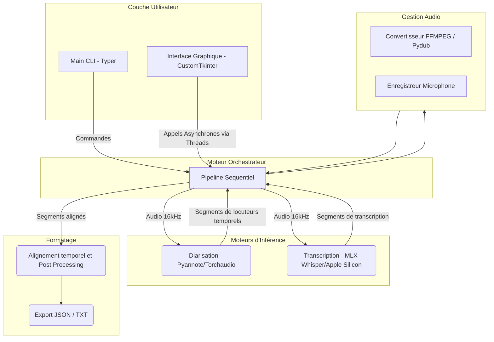

# Manuel d'Architecture : Note Taker Offline

> **Dernière mise à jour :** Avril 2026
> **Statut :** Application de production (v2.0)
> **Gérants du projet :** GIG Consulting

---

## Chapitre 1 : Executive Summary & Vue d'Ensemble

**Note Taker Offline** est une solution complète (CLI et GUI) pour la *transcription* (Speech-To-Text) et la *diarisation* (Speaker Diarization) de réunions privées ou confidentielles sur macOS. Son postulat de base le différencie des nombreuses solutions du marché par une stricte adhérence au principe **Privacy-First** : **l'application tourne 100% hors-ligne (localement)**. Aucune donnée vocale ou texte ne quitte la machine de l'utilisateur.

### Fonctionnalités Clés
- **Saisie Audio Multiple** : Prise en charge des enregistrements micro direct, ou de l'import de fichiers audio variés (MP3, WAV, M4A, etc.).
- **Diarisation Locuteur Haute Précision** : Utilisation de **Pyannote.audio v3.1** pour la détection et la journalisation des locuteurs.
- **Transcription Ultra-Rapide** : Optimisation hardware via **MLX Whisper** d'Apple Silicon pour transcrire la voix avec une inférence GPU proche du temps réel sur les puces M1/M2/M3/M4.
- **Alignement Intelligent** : Fusion asynchrone des segments de locuteurs avec les segments de texte via un algorithme de corrélation temporelle.
- **Export Multi-format** : Mappage des phrases, formatage chronologique propre et export en `.txt` et `.json`.

---

## Chapitre 2 : Architecture Système et Frontières

L'application suit une approche modulaire à 3 temps, fortement axée autour du concept du "Pipeline de données". Chaque système gère des modèles pré-entraînés lourds (entre 1~3Go le modèle) et travaille séquentiellement afin de garantir une consommation mémoire en "pic minimal" (evitant un OOM - *Out of Memory* sur les Macs avec 8 ou 16Go RAM unifiés).

### 2.1 Frontières du Système (System Boundaries)

### 2.2 Composants Critique et Cycle d'Execution
Toute la logique métiers passe par un cycle fixe : 
1. **Normalisation Audio** : Les librairies d'IA (Pyannote & Whisper) attendent implicitement de l'audio mono, ou stéréo transformé. FFMpeg/Pydub harmonise le format à l'ingestion vers un standard WAV 16kHz mono.
2. **Diarisation** -> Libération RAM.
3. **Transcription** -> Libération RAM.
4. **Export**.

---

## Chapitre 3 : Décisions de Conception (Design Decisions)

### 3.1 Pourquoi MLX au lieu de Pytorch-Whisper ?
Les modèles ASR (Automatic Speech Recognition) basés sur Whisper ou Pytorch/Transformers sont notoirement lents sur macOS car l'intégration MPS (Metal Performance Shaders) de Pytorch n'est pas encore parfaite pour l'inférence des "Sequence-to-Sequence models". Le framework **MLX (de Apple Machine Learning Research)** compile le code et les "kernels" nativement vers le GPU d'Apple. Par cette adoption, le moteur Whisper de l'application tourne environ **4x plus vite** que Pytorch-Whisper tout en nécessitant moins du quart de l'empreinte mémoire à l'exécution.

### 3.2 Gestion de la RAM Unifiée
Étant donné que M1/M2/M3/M4 utilisent la RAM "Unifiée" (partagée entre CPU et GPU), la superposition des modèles Pyannote (basé sur Torchaudio) et MLX (basé Metal) en RAM créerait une contrainte majeure pour les Macbooks à 8Go ou 16Go RAM.

> **Décision Architectural** : L'architecture refuse de faire tourner la Détection de Locuteur (Pyannote) et le Speech-To-Text (Whisper) en parallèle (multithreading). Le backend ordonne explicitement : 
> `diarize()` -> `gc.collect() / mx.metal.clear_cache()` -> `transcribe()`. 
> Cette approche sacrifie une vingtaine de secondes sur de longs audios en échange de ne *jamais* crasher le Mac et éviter le "swap over SSD" très pénalisant.

### 3.3 Protection Multiprocessus macOS
macOS, en version récente, "spawn" ses sous-processus de threading plutôt que de les "fork". Pytorch (utilisé par Pyannote) fait un appel à des workers en fond (processus multiples). Si non-gardée, l'application macOS finale compilée via Pyinstaller relancera la Graphical User Interface à l'infinie.
> **Solution** : Ajout du garde `multiprocessing.freeze_support()` au tout début des exécutions, avec blocage explicite des process enfants pour Pytorch dans le header de `main.py`.

### 3.4 Choix de CustiomTkinter pour le Desktop (GUI)
Le projet étant basé en Python pour profiter de Pyannote MLX, des technologies Web (Electron/Tauri) imposeraient d'embarquer un server HTTP FastApi en backend, ce qui alourdirait le binaire (le bundle DMG pèse déjà près de 1Go à cause de Cuda/Pytorch/Tensor. CustomTkinter, couplé à des fils (Threads) d'éxécution permet une UI satisfaisante, robuste et "Native Look" sans embarquer Chrome.
